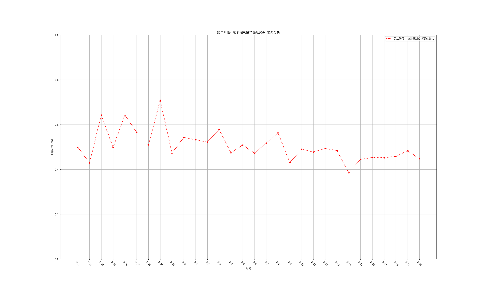
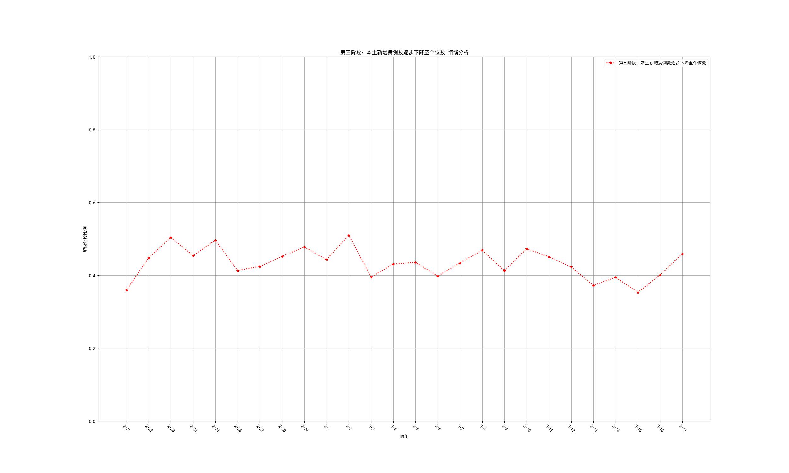
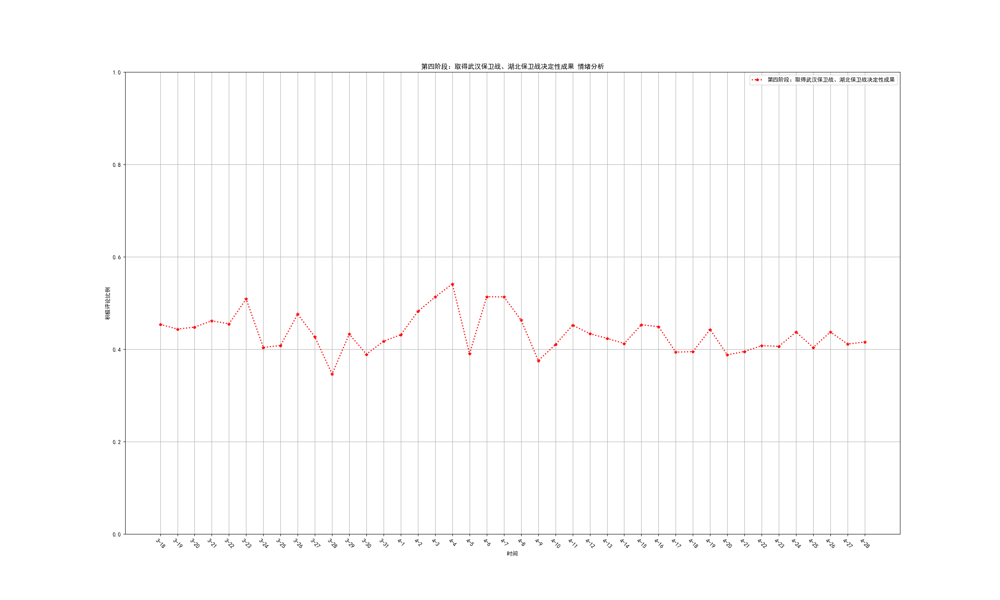
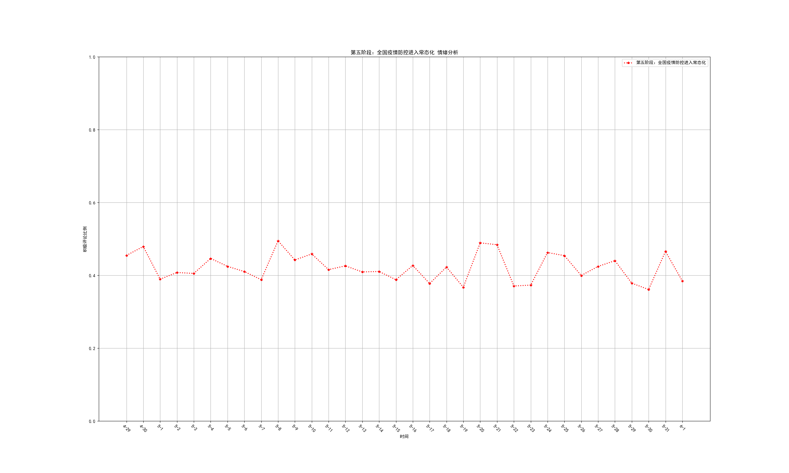
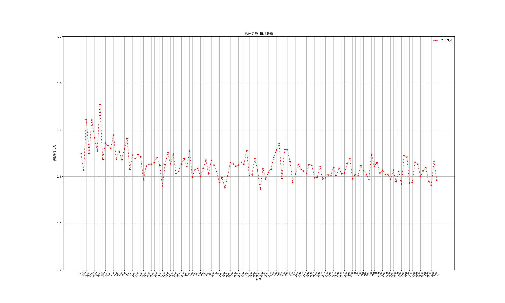
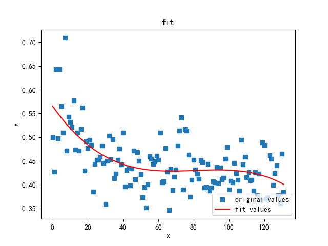

# 新冠疫情下民众的心态和情绪分析

数据科学大作业研究报告。

基本信息：

- 组长：潘昱光，学号；
- 组员：袁军平，学号、侯为栋，学号191250045。
- 开源项目地址：https://github.com/xxh160/data_sci

## 引言
（提出问题）

## 项目整体架构

数据科学大作业后端。

```
├── README.md
├── app
│   ├── __init__.py
│   ├── analysor
│   │   ├── __init__.py
│   │   ├── mindset.py
│   │   ├── visible
│   │   │   ├── TFIDFview.py
│   │   │   └── mindchange.py
│   │   ├── word_cloud
│   │   │   ├── __init__.py
│   │   │   └── ciyun.py
│   │   └── word_frequency
│   │       ├── Mindset.py
│   │       ├── TFIDF.py
│   │       ├── __init__.py
│   │       ├── analysis.py
│   │       ├── bilibiliGP.py
│   │       └── date.py
│   ├── predicator
│   │   ├── __init__.py
│   │   ├── lan_lib
│   │   │   ├── neg
│   │   │   │   └── 2.txt
│   │   │   └── pos
│   │   │       └── 1.txt
│   │   ├── outer
│   │   │   ├── neg
│   │   │   │   ├── neg.0.txt
|   |   |   |   ├── ...
│   │   │   └── pos
│   │   │       ├── pos.0.txt
│   │   │       ├── ...
│   │   ├── predicate.py
│   │   ├── pyhanlp_predication
│   │   │   ├── __init__.py
│   │   │   ├── model.ser
│   │   │   └── predict.py
│   │   ├── snownlp_predication
│   │   │   ├── __init__.py
│   │   │   └── predict.py
│   │   └── store
│   │       ├── bilibili
│   │       │   ├── bilibili_总体走势.csv
│   │       │   ├── ...
│   │       │   └── img
│   │       │       ├── bilibili_总体走势.png
│   │       │       ├── ...
│   │       └── weibo
│   │           ├── img
│   │           │   ├── weibo_总体走势.png
│   │           │   ├── ...
│   │           ├── weibo_总体走势.csv
│   │           ├── ...
│   ├── pretreater
│   │   ├── __init__.py
│   │   ├── pretreat.py
│   │   └── store
│   │       ├── bilibili
│   │       │   ├── bilibili_2020-01-26.csv
│   │       │   └── ...
│   │       ├── south
│   │       │   ├── south_2020-03-25.csv
│   │       │   ├── ...
│   │       └── weibo
│   │           ├── weibo_2020-01-24.csv
│   │           ├── ...
│   ├── scraper
│   │   ├── __init__.py
│   │   ├── bilibili.py
│   │   ├── people.py
│   │   ├── raw
│   │   │   ├── 1传33！大连本轮疫情出现超级传播.csv
│   │   │   ├── ...
│   │   ├── scrape.py
│   │   ├── south.py
│   │   ├── store
│   │   │   ├── bilibili
│   │   │   │   ├── bilibili_2020-01-29.csv
│   │   │   │   ├── ...
│   │   │   ├── south
│   │   │   │   ├── south_2019-12-31.csv
|   |   |   |   ├── ...
│   │   │   └── weibo
│   │   │       ├── weibo_2019-12-31.csv
│   │   │       ├── ...
│   │   └── weibo.py
│   └── util
│       ├── __init__.py
│       ├── csv_util.py
│       ├── news_util.py
│       ├── str_util.py
│       └── yaml_util.py
├── config.py
├── doc
│   ├── analysor.md
│   ├── minutes
│   │   └── 2020-1-20.md
│   ├── predicator.md
│   ├── pretreater.md
│   └── scraper.md
├── manage.py
├── resource
│   ├── __init__.py
│   └── log_config.yml
└── test
    └── __init__.py
```

项目整体为`Flask`应用程序框架，方便做前后端扩展，但受限于事件，前端我们只搭了一个架子，没有正式开始前后端交互工作。

`app`包下共有4个子模块，分别是：

- `scraper`：爬虫模块；
- `pertreater`：数据预处理模块；
- `analysor`：心态分析模块；
- `predicator`：情绪预测模块。

## 数据获取

一开始，我们确立了四个目标：微博、B站、人民日报和南方网。

微博和B站作为民间媒体平台，其评论是我们所着重考虑的数据资源；而人民日报和南方网相对来说偏官方，同时也没有评论获取渠道，于是我们对后者的爬取主要集中于其正文内容。

四个爬虫在代码中分别对应：

- `weibo.py`；
- `bilibili.py`；
- `south.py`；
- `people.py`。

每个数据源都呈现出不同的特点。微博信息多而杂，代码凌乱不易阅读，如果有大规模有序获取信息的需求则必须使用`selenium`类库；B站没有高级搜索接口，难以在初期筛选中寻找到最符合条件的信息，从而带来后期工作量的巨大；人民日报只能通过日期筛选；南方网和微博的情况类似，但是数据质量更差、量更少。

考虑到本次作业的数据集需要体现大众的整体心态，我们选择了更加具有代表性的微博和B站的数据分别进行分析。人民日报的挑选效率过低，南方网可以看作是微博的下位替代品。

在我们获取的数据中，微博和B站分别具有如下特征：

- 微博：话题较多，评论集中现象较少，但爬取困难，整体规模较小；
- B站：弹幕往往集中于少数几个视频，话题集中，文本量虽大但是不具有广泛的代表性。

考虑到机器学习需要覆盖面较广的样本支持，故在情绪分析模块中将微博数据作为核心数据使用；而心态词典的建立对数据量的需求较大，故在心态分析模块将B站数据作为核心数据使用。

## 数据预处理

## 研究方法

本部分将结合具体案例进行详细讲解。

### 心态分析

### 情绪分析

情绪分析的基本思路是，人工给评论打标签形成训练集，结合第三方类库提供的接口训练出具有分类功能的模型，并凭借此模型对给定数据集做出情绪强度的预测。

根据《抗击新冠肺炎疫情的中国行动》白皮书对疫情进行阶段划分。如书中所言，大致可分为如下5个阶段：

- 第一阶段：迅即应对突发疫情，2019-12-31至2020-1-19；
- 第二阶段：初步遏制疫情蔓延势头，2020-1-20至2020-2-20；
- 第三阶段：本土新增病例数逐步下降至个位数，2020-2-21至2020-3-17；
- 第四阶段：取得武汉保卫战、湖北保卫战决定性成果，2020-3-18至2020-4-28；
- 第五阶段：全国疫情防控进入常态化，2020-4-29至今。

在白皮书撰写时，`至今`可指代为2020年6月分。因此本着有效数据占比最大化的原则，我们的代码爬取的数据大多是到2020年6月份为止。

同时需要构建标签集合。一开始我们考虑使用8种情绪的分类集，但是在打标签的过程中逐渐发现各种情绪的区分度不是很大，没有必要进行如此详细的划分，于是将8种情绪压缩为两类，即`pos`和`neg`。最开始训练集的数据几乎完全来自微博爬取的数据，平均每种情绪400条左右。在后续的训练中发现始终无法达到较高的准确率，于是又加入了部分B站的数据，使得每种情绪的训练集达到了平均1000条左右。

训练好的模型读取数据预处理模块中得到的筛选数据，进行情感的预测。由于微信和B站的文本数据量差距较大，故分开来处理。每一天为一个分析单元，读取当天所有的评论数据计算其中`pos`评论的比例来大致估算当天的民众整体情绪状况。结果通过`matplotlib`类库得到折线图，`weibo`的分析图如下所示。

第一阶段，即2019年12月31日至2020年1月19日，这段时间内疫情并没有引起全民的广泛关注，故数据缺失。

字体较小请见谅，横坐标轴过宽不得不作出妥协。

以下图片结果的训练集为手动标签库`lan_lib`。

第二阶段，`pos`评论占总评论比例的期望为0.512601424647188。



第三阶段，`pos`评论占总评论比例的期望为0.4459705733743494。



第四阶段，`pos`评论占总评论比例的期望为0.44501437588906284。



第五阶段，`pos`评论占总评论比例的期望为0.43785604659435956。



总览，`pos`评论占总评论比例的期望为0.45871959862649686。



从以上5组数据可以明显看出，疫情期间民众总体还是偏消极的，但是乐观和悲观情绪占比差别不大。我们着重研究最后一张也就是总览的图。

我们的普遍观点应该是随着时间轴渐渐向后，民众的情绪应该会倾向于更加乐观。但是总览的折线图体现出我国民众乐观情绪出现的高峰集中在疫情早期，`pos`比占比最高的三天即2020-1-24，2020-1-26以及2020-1-29。

通过对源数据文件进行关键词提取和摘要提取可以发现：

- 1月24号，`[武汉, 加油, 辛苦, 没有, 希望]`，`[感谢所有医护人员还有所有付出的人   武汉加油, 相信国家  🙏武汉加油, 武汉朋友加油(ง •̀_•́)ง, 姐姐武汉加油, 武汉加油//@花果山总务]`；
- 1月26号，`[口罩, 武汉, 没有, 回复]`，`[我们这边没有单独的扔口罩的垃圾桶, #孝感肺炎# #湖北不止一个武汉# 请关注武汉周边乡镇农村, 今天剪了用过的口罩, 谁要是拿做二次口罩, N95口罩一个都没有了]`；
- 1月29号，`[加油, 武汉, 平安, 医院, 疫情]`，`[橘朵加油   武汉加油 中国加油旺仔闹海, @平安温州 温州有没有要建小汤山模式医院, 武汉加油 中国🇨🇳加油不像话的碎碎念, 武汉加油 中国加油白柚唄, #武汉加油# 加油]`。

这个时候全国都沉浸在团结一心对抗疫情的乐观情绪中，所以相对来说`pos`占的比例高业绩理所应当了。

同时，`pos`指数最低的一天为2020-3-28。通过关键词提取和摘要提取，可以得到关键词列表`[回复, 共, 病毒, 口罩, 会]`，摘要列表`[希望你的视频能让你们国家的民众更加重视疫情诺式媒女, 戴口罩诗姐八美国政治, 我就想知道原来那第一个戴口罩被嘲讽的议员在干嘛故心, 又开始犯起了这么容易变异的rna病毒真的会有疫苗吗的嘀咕i糊里糊涂啊啊, 再乱也是你们自己国家的事米发嗖]`可见此时国人的情绪相对消极大概率不是因为国内如何，而是因为国外如何，国内人对于国外的抗疫不力是心怀怨气的。具体分析见心态分析部分，此处不详细展开。

同时，通过最小二乘法拟合多项式三次曲线作拟合，得到如下拟合函数图。



其中，横坐标本来是时间，在拟合时简单地替换成了0-`len`(l横坐标list)的数字，故准确性可能有待考量。但是我们仍然可以通过这幅图看出整体中国人的情绪是偏消极走向的，而消极的原因上文已经讨论过，是国外的混乱不给力，而不是国内的政策失误。

所以总体看来，中国人在疫情初期由于自己国家抗疫的成功而感到乐观，但是随着时间的流逝，在国外出现各种神操作的时候，国人开始不耐烦并且对别的国家报以冷漠和嘲讽。

## 分工情况

- `scraper`： 潘昱光、袁军平、侯为栋
- `pretreater`：潘昱光
- `analysor`：袁军平
- `predicator`：侯为栋

## 意见及想说的话

`nmsl`